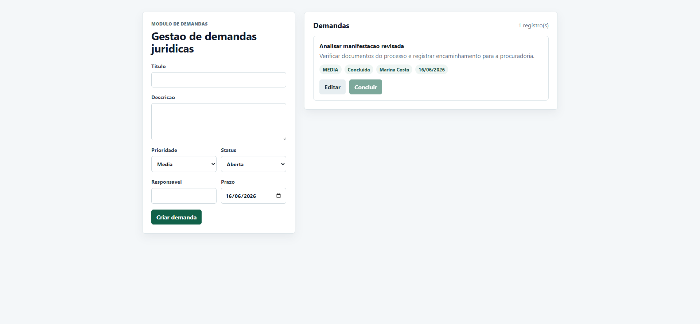

# Teste Tecnico Full Stack - Demandas Juridicas

Projeto enxuto para demonstrar uma feature ponta a ponta com Java, Spring Boot, React, PostgreSQL, validacoes, logs e testes.

## Como rodar

Requisito recomendado: Docker Compose.

```bash
docker compose up --build
```

URLs:

- Front-end: http://localhost:5173
- API: http://localhost:8080
- Health check: http://localhost:8080/actuator/health

Para parar e remover o banco local:

```bash
docker compose down -v
```

## Execucao local sem Docker

Backend requer JDK 21 e PostgreSQL local:

```bash
cd backend
./gradlew bootRun
```

Frontend requer Node 25+ ou versao compativel com Vite 8:

```bash
cd frontend
npm install
npm run dev
```

## Endpoints

Base: `/api/demandas`

| Metodo | Rota | Descricao |
| --- | --- | --- |
| GET | `/api/demandas` | Lista demandas |
| GET | `/api/demandas/{id}` | Busca demanda por id |
| POST | `/api/demandas` | Cria demanda |
| PUT | `/api/demandas/{id}` | Edita demanda |
| PATCH | `/api/demandas/{id}/concluir` | Marca demanda como concluida |

Payload de criacao/edicao:

```json
{
  "titulo": "Analisar manifestacao",
  "descricao": "Verificar prazo e registrar encaminhamento.",
  "prioridade": "ALTA",
  "status": "ABERTA",
  "responsavel": "Marina Costa",
  "prazo": "2026-06-30"
}
```

Valores aceitos:

- `prioridade`: `BAIXA`, `MEDIA`, `ALTA`
- `status`: `ABERTA`, `EM_ANDAMENTO`, `CONCLUIDA`

## Testes

Backend:

```bash
cd backend
./gradlew test
```

Frontend:

```bash
cd frontend
npm install
npm run build
```

## Decisoes tecnicas

- Spring Boot monolitico: suficiente para o desafio, sem microsservicos artificiais.
- PostgreSQL no Compose e H2 nos testes: producao local realista, teste rapido e independente de Docker.
- React com estado local e `fetch`: reduz dependencias e deixa o fluxo facil de avaliar.
- Logs de negocio nos eventos principais: criacao, edicao, conclusao e falha de validacao.
- `ddl-auto=update`: aceitavel para teste tecnico; em producao eu usaria Flyway/Liquibase.

## Analise de incidente

A parte de analise esta em [`docs/incidente.md`](docs/incidente.md).

## Evidencia de funcionamento


